# Projet Final (Individuel)

## Présentation du projet

### Technologies utilisées
- **Backend** : Node.js, Express
- **Infrastructure** : Terraform, Ansible
- **CI/CD** : GitHub Actions
- **Monitoring** : Prometheus, Grafana
- **Logs**: Loki
- **Gestion des secrets** : GitHub Secrets

---

## Documentation détaillée

- La documentation sur la gestion des **snapshots** est disponible dans [`/snapshots/README.md`](./snapshots/README.md).
- La procédure complète de **rollback** est décrite dans [`/rollback/README.md`](./rollback/README.md).

---

## Mise en place du GitFlow

### Schéma des branches
- **main** : branche de production
- **develop** : intégration des nouvelles fonctionnalités
- **feature/*** : développement de nouvelles fonctionnalités
- **release/*** : préparation des versions
- **hotfix/*** : corrections urgentes en production

### Historique de commit et branches
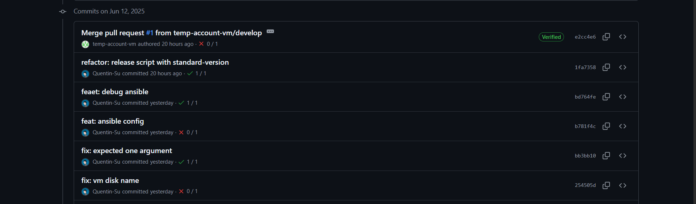
*Historique des commits sur `develop`*

---

## Pipelines CI/CD distincts

### Explication
Le projet utilise **deux workflows GitHub Actions séparés** pour gérer les déploiements en environnement de développement (staging) et de production. Cette séparation permet d’adapter les étapes et les contrôles selon l’environnement cible, tout en renforçant la sécurité et la fiabilité des déploiements.

- `.github/workflows/ci-cd-dev.yml` : pipeline dédié à l’intégration continue et au déploiement sur l’environnement de développement/staging.
- `.github/workflows/ci-cd-prod.yml` : pipeline dédié au déploiement en production, avec des étapes de validation supplémentaires.

### Différences principales
- **Déclencheurs** :  
    - Le workflow *dev* s’exécute sur les branches `develop`.
    - Le workflow *prod* s’exécute uniquement sur la branche `main` et dispose des étapes en plus.
- **Étapes** :  
    - Le pipeline *dev* inclut des étapes de tests, build, packaging et déploiement sur l’environnement de staging.
    - Le pipeline *prod* ajoute des contrôles, la création de snapshot, le déploiement en production et la gestion du rollback. La création de CHANGELOG et Tags

### Fichiers YAML
- [Workflow Dev](.github/workflows/deploy-staging.yml)
- [Workflow Prod](.github/workflows/deploy-production.yml)


*Historique des commits sur `develop`*

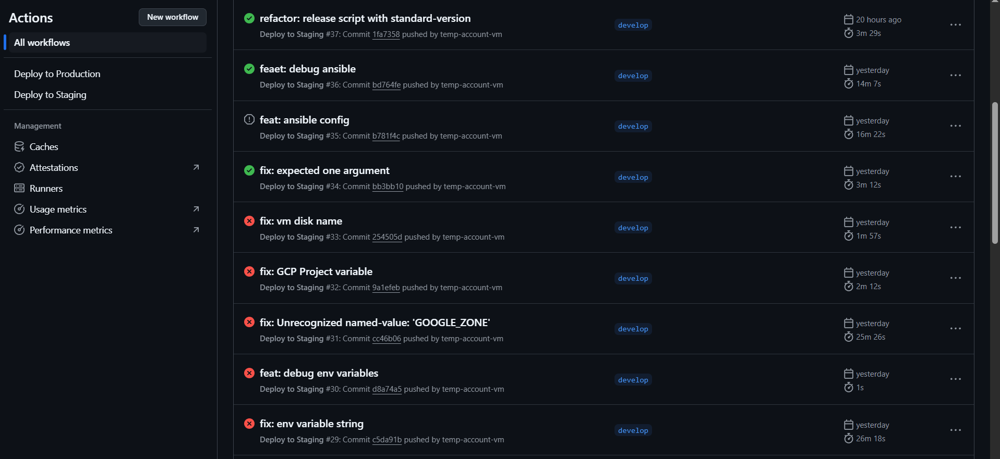
*Workflows*

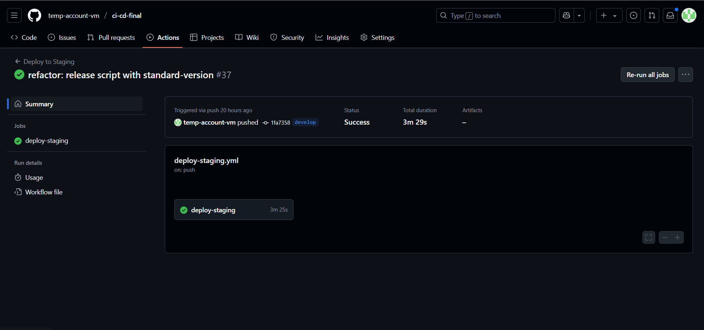
*Workflows summary*


*Jobs (Success)*

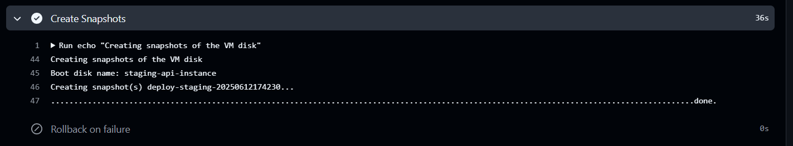
*Snapshot*

---

## Déroulement du workflow de déploiement en production

- **Déclenchement** :  
    Le workflow s’exécute automatiquement lors d’un push sur la branche `main`, lors de la création d’un tag de version (`v*.*.*`), ou manuellement via l’interface GitHub.

- **Préparation de l’environnement** :  
    - Récupération du code source et des tags Git.
    - Chargement des variables d’environnement et des secrets nécessaires (GCP, SSH, etc.).
    - Restauration éventuelle de l’état Terraform depuis le cache.

- **Infrastructure avec Terraform** :  
    - Authentification à Google Cloud.
    - Initialisation de Terraform.
    - Destruction éventuelle de l’infrastructure existante puis création de la nouvelle (apply).
    - Sauvegarde de l’état Terraform.

- **Déploiement applicatif avec Ansible** :  
    - Récupération de l’IP de la VM provisionnée.
    - Création d’un fichier d’inventaire Ansible.
    - Exécution du playbook de déploiement de l’application.
    - Exécution du playbook de monitoring (Grafana, Prometheus, etc.).

- **Snapshots & Rollback** :  
    - Création automatique d’un snapshot du disque de la VM après déploiement réussi.
    - En cas d’échec, restauration du disque à partir du dernier snapshot disponible.

- **Release & publication** :  
    - Installation des dépendances Node.js.
    - Exécution d’un script de release pour générer changelog, tag et publier la release sur GitHub.

Ce workflow garantit un déploiement automatisé, traçable et sécurisé, avec gestion des erreurs et possibilité de rollback rapide.

---

## Packaging et versionning

- **Versionnement sémantique (SemVer)** : format `MAJOR.MINOR.PATCH` (ex: v1.0.0)
- **Utilisation de git tag** : chaque release est taguée (`git tag v1.0.0`)
- **Stockage des artefacts** : via GitHub Releases

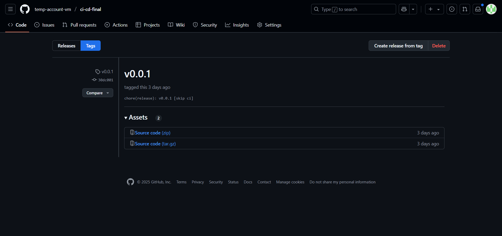
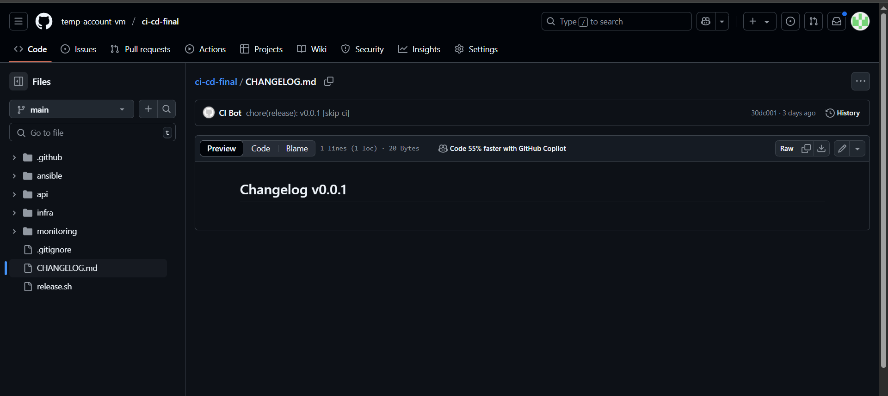

---

## Gestion des secrets et environnement

- **Méthode** : GitHub Secrets pour les clés sensibles
- **Bonnes pratiques** : aucun secret dans le code source

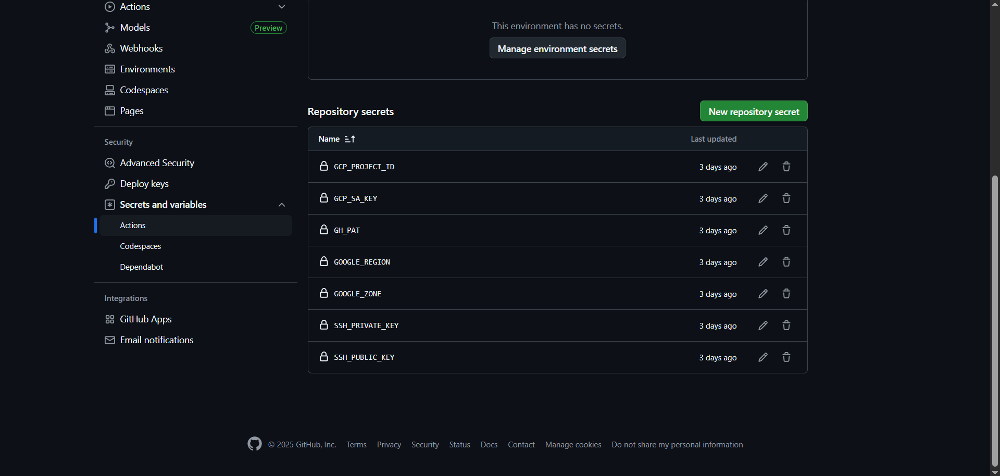

---

## Dashboard & Logs

Le service **Grafana** est déployé automatiquement avec l’infrastructure et déjà préconfiguré avec un dashboard personnalisé pour le monitoring de l’application. Ce dashboard permet de visualiser en temps réel les métriques collectées par Prometheus (CPU, mémoire, requêtes HTTP, etc.) ainsi que les logs centralisés via Loki.

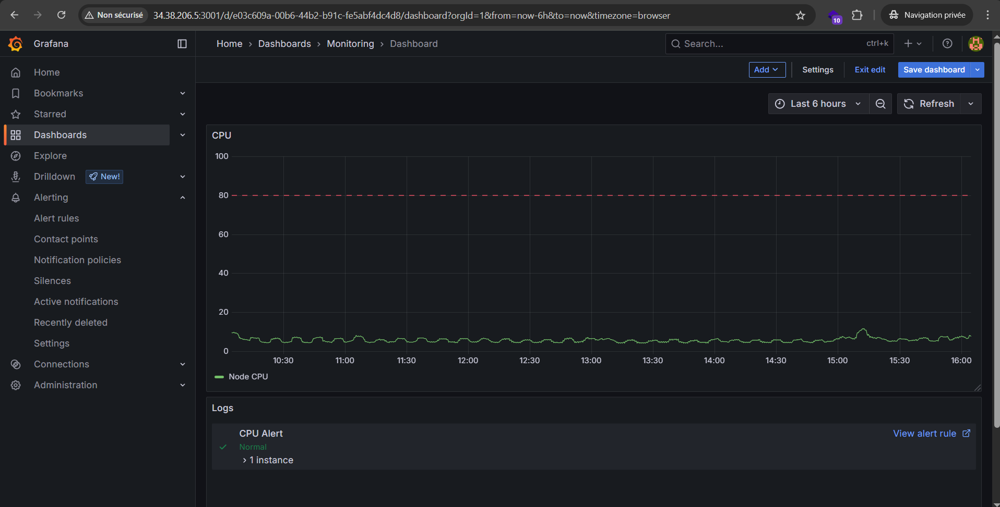
*Dashboard Grafana préconfiguré*

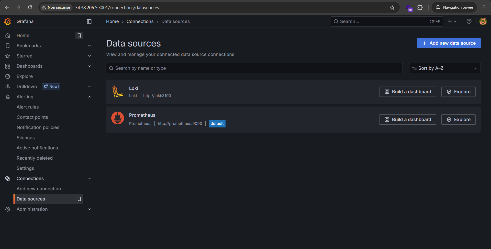
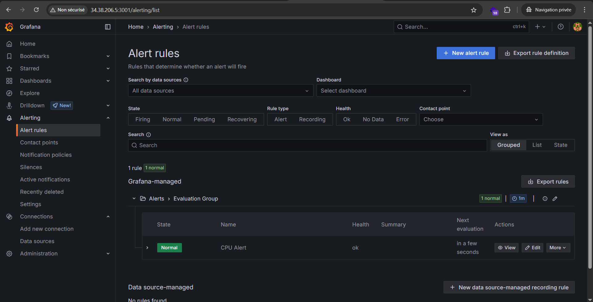

---

## Procédures documentées

### Déploiement
1. Pousser sur `main` ou `release/*`
2. Le pipeline CI/CD déploie automatiquement sur l’environnement cible

### Restauration (rollback)
1. Déclencher le job `rollback` dans le pipeline
2. L’état de la base et de l’application est restauré à partir du dernier snapshot

### Plan de versionnage et tag
- Incrémentation selon SemVer
- Tag créé à chaque release stable

---

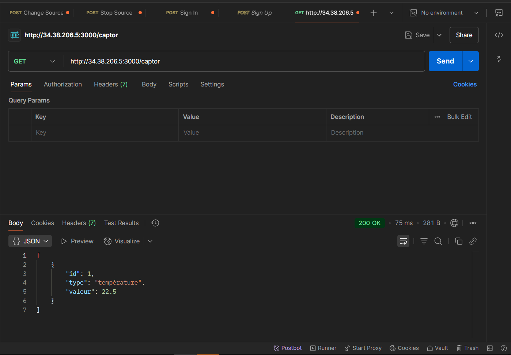
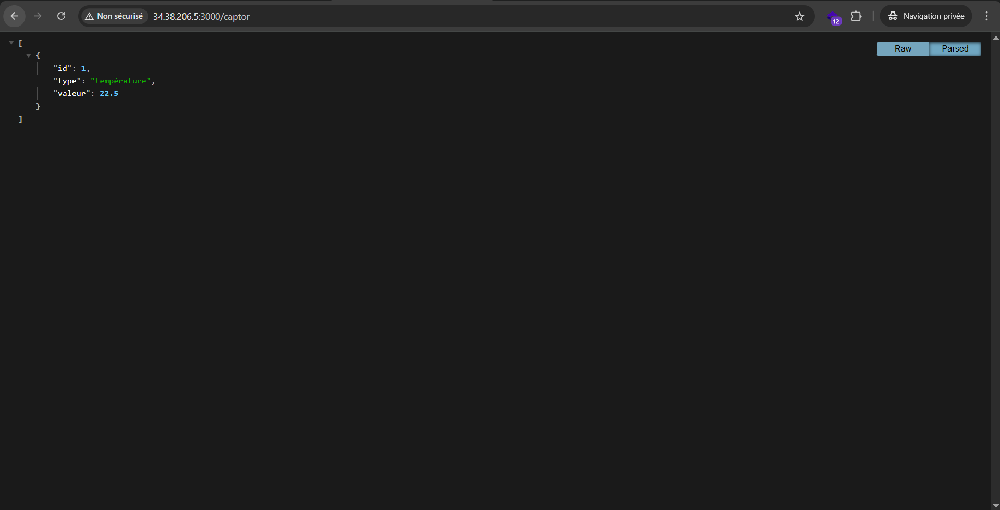

---

## Structure du dépôt Git

```
├───.github
│   └───workflows
├───ansible
├───api
│   └───node_modules
├───images
├───infra
│   ├───production
│   └───staging
├───monitoring
│   ├───grafana
│   │   ├───dashboards
│   │   └───datasources
│   ├───loki
│   ├───prometheus
│   └───promtail
├───rollback
├───snapshots
```